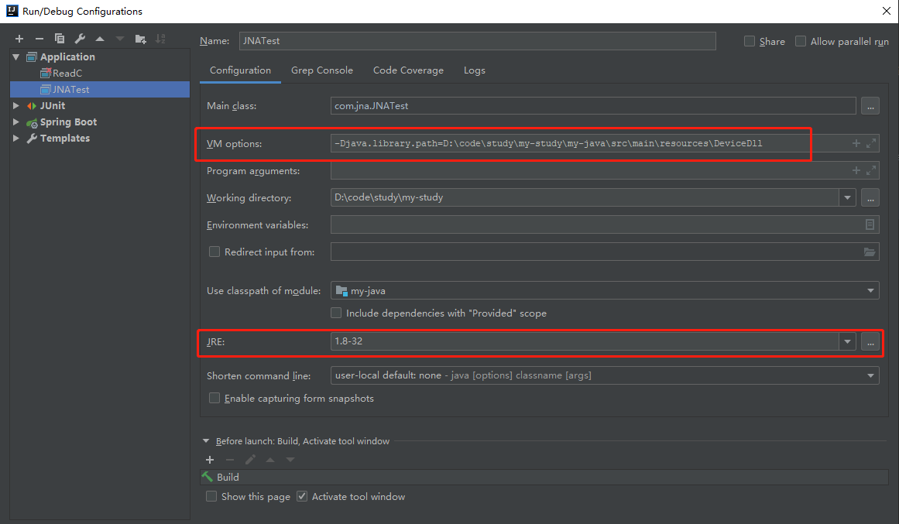

[TOC]

## 一、JNA (Java Native Access)

JNA(Java Native Access)框架是一个开源的Java框架，建立在经典的JNI的基础之上的一个框架。


## 二、使用步骤

>1. 需配置VM options: -Djava.library.path=**_[类库所在位置]_**
>2. jdk 需要根据dll环境进行配置是64位还是32位

### 1. 引入依赖

```xml
            <dependency>
                <groupId>net.java.dev.jna</groupId>
                <artifactId>jna</artifactId>
                <version>5.5.0</version>
            </dependency>
```

### 2. 设置启动环境及参数

2.1 启动时设置java类库地址（or 把dll文件直接放在java类库路径下 or 使用System.load() 绝对路径加载）

> VM options: -Djava.library.path=**_[类库所在位置]_**



2.2 根据dll文件属性，配置对应的jre环境，64位 or 32位。

### 3. 系统引用

3.1 根据dll名称，把dll文件内容加载至内存（注：不能有文件名后缀，且该dll文件必须在文件类库目录下）

```java
System.loadLibrary("TestJNI"); // 从java类库中加载
System.load("C://Documents and Settings//TestJNI.dll"); //or 从绝对路径中直接下载
```

### 4. 创建接口，通过接口引用

```java
// 继承Library or StdCallLibrary
public interface ZT_DEV extends Library {
    // 通过反射加载对象
        ZT_DEV lib = Native.load("ZT_DEV", ZT_DEV.class);

        // ZT_DEV_OpenDevice为ZT_DEV.dll中的一个方法.(注意类型转换)
        int ZT_DEV_OpenDevice(int nDeviceType, String strComm, IntByReference nHandle);
    
    // c++ 中原生方法参数
    // int ZT_DEV_OpenDevice(int nDeviceType,const char *strComm,int *nHandle)
    }

public static void main(String[] args) throws Exception {

        System.load("D:\\code\\study\\my-study\\my-java\\src\\main\\resources\\DeviceDll\\ZT_DEV.dll");
        System.out.println(System.getProperty("java.library.path"));

//        System.loadLibrary("ZT_DEV");

        IntByReference intByReference = new IntByReference();
        String msg = "COM1:9600:E:8:1";
        System.out.println(ZT_DEV.lib.ZT_DEV_OpenDevice(1,msg,intByReference));
        System.out.println(intByReference.getValue());

    }
```


## 三、关系映射

### 1. java与C++关系映射

| C++     | Java           |
| ------- | -------------- |
| char *  | String         |
| word    | short          |
| byte    | byte           |
| byte[]  | byte[]         |
| dword   | int            |
| long    | NativeLong     |
| Void *  | Pointer        |
| lpvoid  | Pointer        |
| lpDword | IntByReference |
| HWND    | HWND           |
| char[]  | byte[]         |
| byte *  | Pointer        |

### 2. java 与 c 语言关系映射

| Java           | 类型           | C类型原生表现                                                |
| -------------- | -------------- | ------------------------------------------------------------ |
| boolean        | int            | 32位整数(可定制)                                             |
| byte           | char           | 8位整数                                                      |
| char           | wchar_t        | 平台依赖                                                     |
| short          | short          | 16位整数                                                     |
| int            | int            | 32位整数                                                     |
| long           | long,__int64   | 64位整数                                                     |
| float          | float          | 32位浮点数                                                   |
| double         | double         | 64位浮点数                                                   |
| Buffer/Pointer | pointer        | 平台依赖(32或64位指针)                                       |
| <T>            | pointer/array  | 32或64位指针(参数/返回值)邻接内存(结构体成员)                |
| String         | char*          | /0结束的数组(nativeencodingorjna.encoding)                   |
| WString        | wchar_t*       | /0结束的数组(unicode)                                        |
| String[]       | char**         | /0结束的数组的数组                                           |
| WString[]      | wchar_t**      | /0结束的宽字符数组的数组                                     |
| Structure      | struct*/struct | 指向结构体的指针(参数或返回值)<br>(或者明确指定是结构体指针)结构体(结构体的成员)<br>(或者明确指定是结构体) |
| Union          | union          | 等同于结构体                                                 |
| Structure[]    | struct[]       | 结构体的数组，邻接内存                                       |
| Callback       | <T>(*fp)()     | Java函数指针或原生函数指针                                   |
| NativeMapped   | varies         | 依赖于定义                                                   |
| NativeLong     | long           | 平台依赖(32或64位整数)                                       |
| PointerType    | pointer        | 和Pointer相同                                                |

## 四、类库地址

### 4.1 windows

```java
System.getProperty("java.library.path");
```

1. 和jre相关的目录
2. 程序当前目录
3. Windows目录
4. 系统目录(system32)
5. 系统环境变量path指定的目录

### 4.2 linux 地址 及 jar启动

> 在/etc/profile 后面加上一行 export LB_LIBRARY_PATH=[新加类库地址]
>
> ```java
> java -jar -Djava.library.path=[新类库地址] XXX.jar
> ```


## 五、出现错误及解决

1. **java.lang.UnsatisfiedLinkError: no dcrf32 in java.library.path ：系统没找到对应的dll文件**

解决：

- 项目启动时设置 java库地址


- 把dll文件，放置到java库中。具体地址为：System.getProperty("java.library.path")

- ```java
  System.load("C://Documents and Settings//TestJNI.dll"); //绝对路径
  ```

2. **java.lang.UnsatisfiedLinkError: XXX\dcrf32.dll: Can't load IA 32-bit .dll on a AMD 64-bit platform：dll环境和当前环境不匹配**

解决：把当前jdk环境改成32位


3. **java.lang.Error: Invalid memory access**

   类型映射错误，java接口继承Library中的方法，必须和dll文件中的方法一致，且类型能相互映射上。如：dll中 **_int*_** 必须映射为  **IntByReference**

   

4. **Error looking up function 'sum': 找不到指定的程序。**

   java接口方法和dll方法未匹配

   

## 六、参考链接

[1. Java加载dll或so库文件的路径 java.library.path](https://www.cnblogs.com/ylz8401/p/9605498.html)

[2. JNA实战笔记汇总（二）——JNA和C / C ++的数据类型映射（dll函数回调、结构体、指针)](https://blog.csdn.net/hjing123/article/details/89709845)


