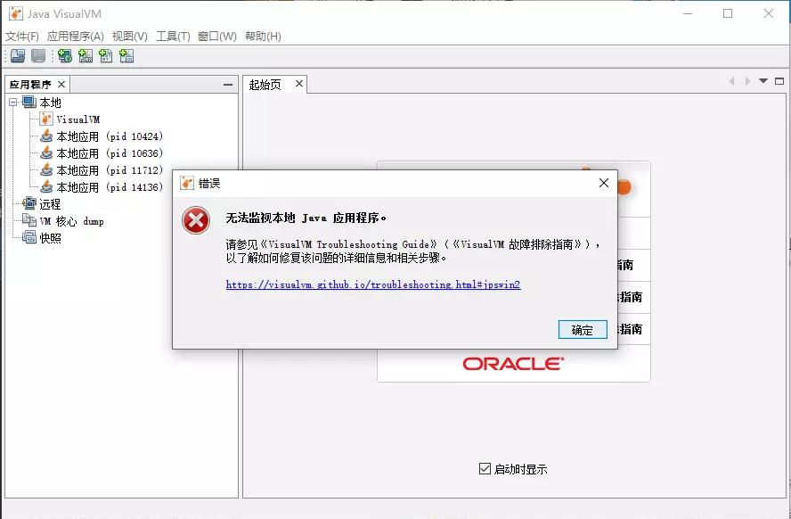
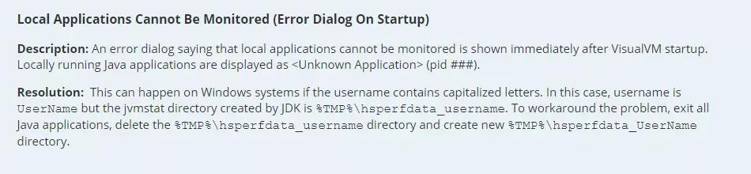
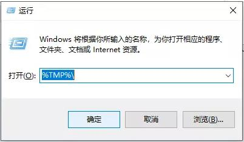
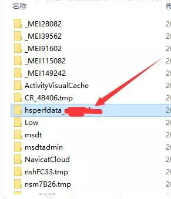

[TOC]

# JvisualVm提示无法监视本地Java应用程序解决办法

## 一、问题描述

有时候我们用jdk自带的JvisualVm来监控本地jvm的时候，会弹出一个“无法监视本地Java应用程序”的提示。

## 二、处理方法

根据官网的处理方法，修改一下%TMP%\hsperfdata_username就可以了。

处理过程：
1、要先关闭IDEA，并且关闭所有的Java程序；
2、按Win + R，然后输入：%TMP%；

3、找到 hsperfdata 开头的文件夹

4、按用户名修改一下这个文件名，即hsperfdata_ 的后面写上你的用户名，如果用户名有大写，这里全部改为小写，查询用户名的方式： [查看用户名](https://jingyan.baidu.com/article/9225544679ab37851648f489.html)
5、修改后的文件名应该为 hsperfdata_xxxx ，xxxx就是 步骤4 看到的用户名。

如果以上修改完成后，发现还是提示无法监视本地Java应用程序，那么右键hsperfdata开头的文件，然后查看属性，点击安全，为当前用户赋予完全控制的权限。

## 三、参考链接

 [JvisualVm提示无法监视本地Java应用程序解决办法](https://www.pianshen.com/article/53091198697/)

