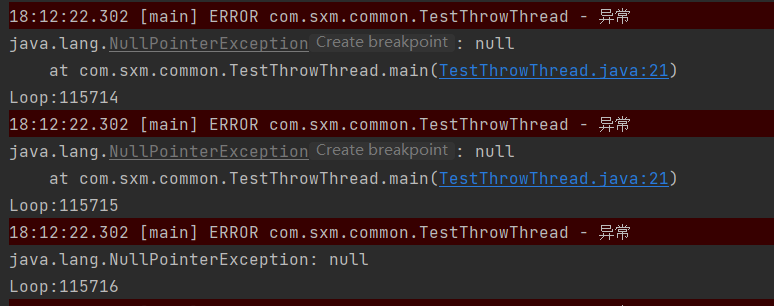

[TOC]

# 一、 问题概述

今天去服务器后台看日志，发现有很多`NullPointerException`异常。我下意识的去找异常栈信息，想看下到底是哪行代码导致了空指针。但是发现日志中只打印出了如下日志：

```java
null
java.lang.NullPointerException: null
```

我怀疑是不是打印日志的时候没有将异常栈打印出来，于是又去翻看应用代码核实。但是发现日志打印的代码也是正常的。

```java
logger.error(e.getMessage(),e);
```

这就纳闷了，于是又怀疑是不是日志配置有问题。折腾了一番发现这些配置都没问题。一时没有了思路，只好去求助万能的百度。

#  二、问题原因

我在网上找到了这么一段描述：

> JVM 虚拟机会对异常信息进行优化，当相同异常出现很多次，会认为它是热点异常，忽略掉异常堆栈信息；通过增加 JVM 参数：-XX:-OmitStackTraceInFastThrow 可解决。

这个描述能很好的解释我发现的问题。代码中出现空指针异常的地方是一个定时任务在不停地调用，当这个异常出现次数太多时 JVM 就会将其过滤掉。

为了验证我的猜想，我去找了下这个服务刚刚启动时的代码，发现这个异常栈是正常打出的，这也验证了自己的猜想，通过异常栈信息也找到了导致空指针异常的代码。

# 三、问题重现

下面是自己写的一段代码来显示这个问题（异常太少，不一定测出来）：

```java
import lombok.extern.slf4j.Slf4j;
import org.slf4j.Logger;
import org.slf4j.LoggerFactory;

@Slf4j
public class TestThrowThread {
    static Logger logger = LoggerFactory.getLogger(TestThrowThread.class);

    public static void main(String[] args) {
        for (int i = 0; i < 118000 ; i++) {
            try{
                System.out.println("Loop:"+(i+1));
                String uer = null;
                uer.getBytes();
            }catch (Exception e){
                logger.error("异常",e);
            }
        }
    }
}
```



**在JVM启动参数中增加：-XX:-OmitStackTraceInFastThrow后,异常就能正常输出**

# 二、参考链接

[1. NullPointerException 没有打印异常栈问题追踪(全文参考)](https://www.cnblogs.com/54chensongxia/p/12930610.html)


