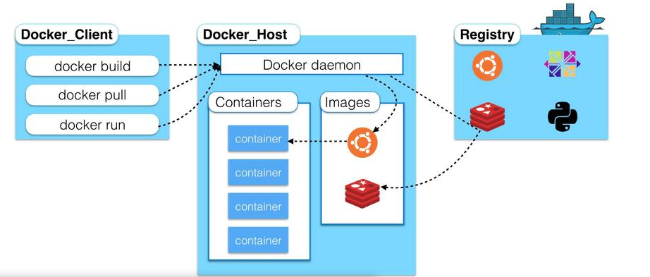
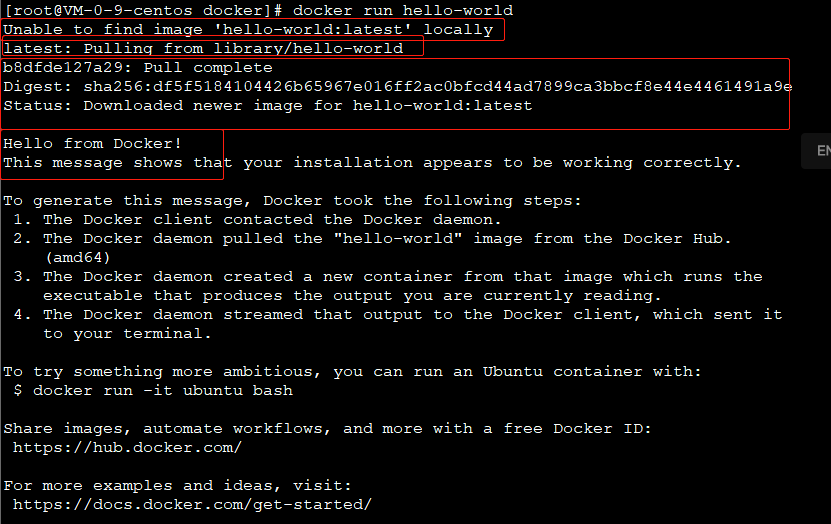
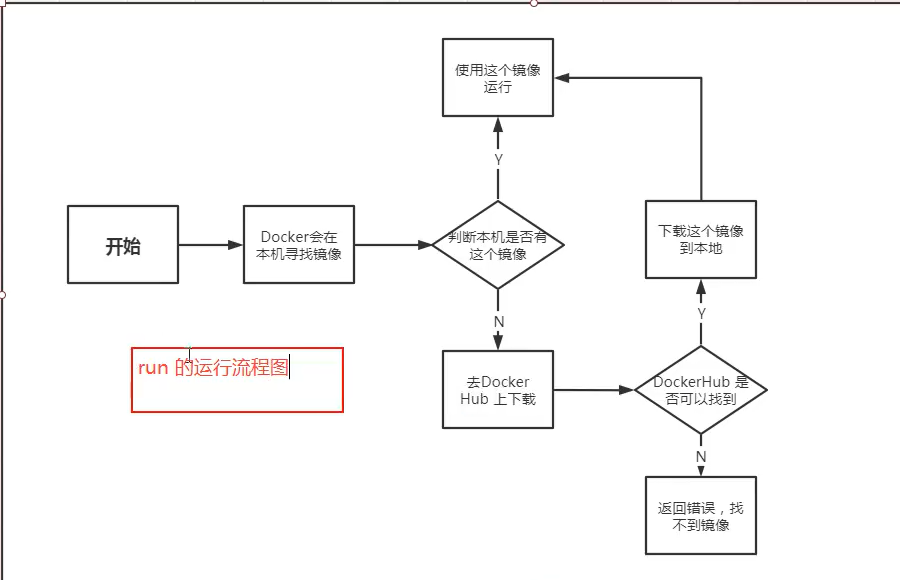
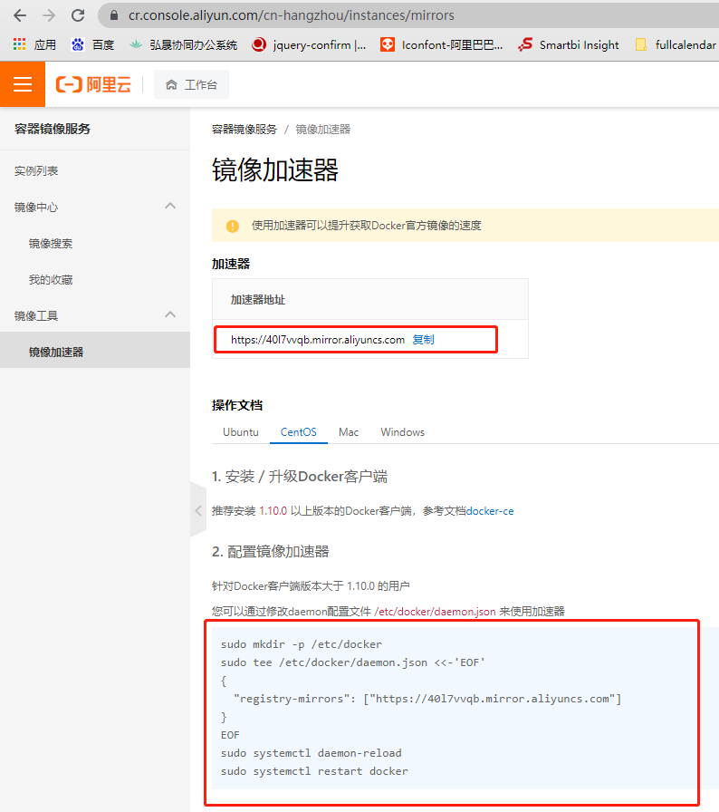

[TOC]

# 一、Docker 概述

## 1. docker为什么会出现？

Docker 是一个开源项目，诞生于 2013 年初，最初是 dotCloud 公司内部的一个业余项目。它基于 Google 公司推出的 Go 语言实现。

## 2. docker能干啥？

>之前的虚拟机技术


虚拟机技术缺点：

1. 资源占用多
2. 冗余步骤多
3. 启动慢

> 容器化技术：==容器化技术模拟的不是一个完整的操作系统。==


比较docker 和 虚拟机技术的不同

* 传统虚拟机，虚拟出一条硬件，运行一个完整的操作系统，然后再系统上安装和运行软件
* 容器内的应用直接运行在宿主机的内容，容器是没有自己的内核，也没有虚拟硬件，所以很轻便
* 每个容器间是相互隔离的，每个容器内都有一个属于自己的文件系统，互不影响


> Devops (开发、运维)

**1. 应用更快速的交付和部署**

​	传统：一堆帮助文档，安装程序

​	Docker：打包镜像发布测试，一键运行

**2. 更快捷的升级和扩缩容**

​	使用Docker之后，部署应用就和搭积木一样

**3. 更简单的系统运维**

**4. 更高效的计算资源利用**

Docker是内核级别的虚拟化，可以在一个物理机运行很多容器实例，服务器性能可以压缩到极致。


# 二、 Docker 安装

## 1. docker 基本组成



**镜像（image）**：

​	docker镜像就好比一个模板，可以通过这个模板创建容器服务，tomcat镜像—>run—>tomcat01容器（提供服务器），通过镜像可以创建更多容器（最终服务运行或者项目运行就是在容器中）

**容器（container）**：

​	docker利用容器技术，独立运行一个或者一组应用，通过镜像创建。

​	启动、停止、删除、基本命令

​	目前可以把容器理解为一个简单的linux系统

**仓库（repository）**：

​	存放镜像的地方，分为共有仓库和私有仓库。Docker Hub（默认），配置镜像加速，阿里云、网抑云等。。


## 2. docker安装

> ### 1. 环境查看


> ### 2. docker 安装

```shell
#1. 卸载老版本docker
yum remove docker \
        docker-client \
        docker-client-latest \
        docker-common \
        docker-latest \
        docker-latest-logrotate \
        docker-logrotate \
        docker-engine

#2. 需要安装包
yum install -y yum-utils

#3. 设置镜像仓库(使用国内镜像)
yum-config-manager \
    --add-repo \
    http://mirrors.aliyun.com/docker-ce/linux/centos/docker-ce.repo

# 更新yum软件包索引
yum makecache fast

#4. 安装docker 相关 docker-ce社区，eeq企业版
yum install -y docker-ce docker-ce-cli containerd.io

#5. 启动docker
systemctl start docker

#6. 查看是否安装成功
docker version

#7. 查看下载hello-world 镜像
docker run hello-world
```






> docker 卸载

```shell
# 1. 卸载依赖
yum remove -y docker-ce docker-ce-cli containerd.io

# 2. 删除资源
rm -rf /var/lib/docker
rm -rf /var/lib/containerd
```

> ### 3. 配置阿里云镜像加速器

阿里云镜像加速地址: https://cr.console.aliyun.com/cn-hangzhou/instances/mirrors



```shell
# 修改配置文件 重新启动服务
sudo mkdir -p /etc/docker
sudo tee /etc/docker/daemon.json <<-'EOF'
{
  "registry-mirrors": ["https://40l7vvqb.mirror.aliyuncs.com"]
}
EOF
sudo systemctl daemon-reload
sudo systemctl restart docker
```


# 参考链接

[1. yum 安装卸载方式](https://www.cnblogs.com/qinghuaL/p/11597695.html)
