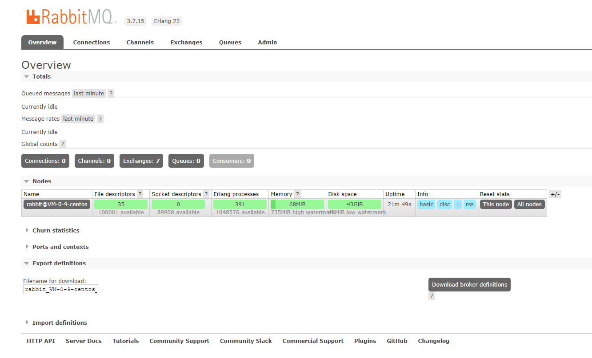
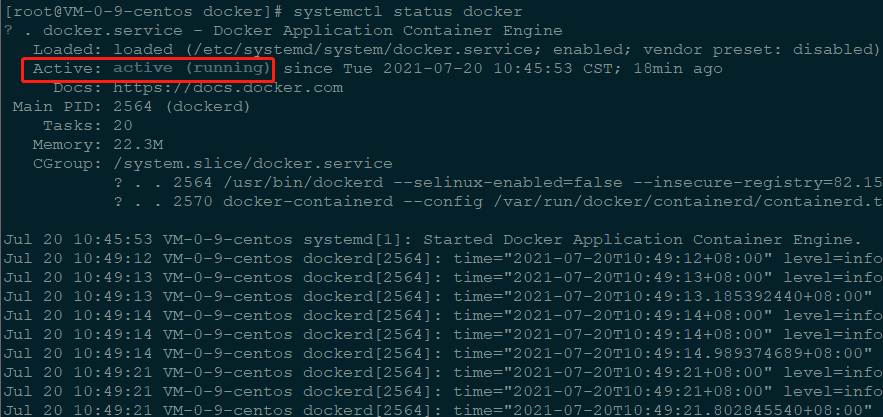

[TOC]

# 一、安装 frp 内网穿透

[frp](https://github.com/fatedier/frp/blob/master/README_zh.md)就是一个[反向代理软件](https://www.zhihu.com/question/24723688)，它体积轻量但功能很强大，可以**使处于内网或防火墙后的设备对外界提供服务**，它支持HTTP、TCP、UDP等众多协议。

## 1. 服务端配置步骤

1. 下载安装包

```shell
wget https://github.com/fatedier/frp/releases/download/v0.13.0/frp_0.13.0_linux_amd64.tar.gz
```
2. 解压安装包
```shell
tar -zxvf frp_0.13.0_linux_amd64.tar.gz
```

3. 进入安装包内
```shell
cd frp_0.13.0_linux_amd64
```

4.修改服务器配置文件(配置样例如下)

```shell
vim frps.ini
```
>[common]
>bind_port = 7000 \#这个端口指的是客户端与服务端通信使用的端口
>
>
>
>#配置 dashboard（可选）
>
>dashboard_port = 7500
>
>#dashboard 用户名密码，默认都为 admin
>
>dashboard_user = admin
>dashboard_pwd = admin
>
>#web远程访问端口
>
>#vhost_http_port = 80
>#vhost_http_port = 7001

5. 后台启动（在frp_0.13.0_linux_amd64 目录下）
```shell
nohup ./frps &
```


## 2. 客户端配置步骤

>1. [frp下载](https://github.com/fatedier/frp/releases)
>
>2. 修改配置文件 **frpc.ini** 如下
>
>   [common]
>   server_addr = xx.xxx.xxx.xxx  # 公网服务器ip
>   server_port = 7000 
>
>   
>
>   [ysf]	--可添加多个，每一个名字一样才行
>
>   #web服务网络类型,可选http https
>
>   type = tcp
>   local_ip = 192.168.1.29
>
>   #内网机器的web服务端口
>
>   local_port = 8881
>   remote_port = 8881
>
>3. 在**cmd**指令中启动
>
```shell
frpc.exe
```


## 3. 注意

1. 服务端**frp**配置的所有公网端口均需放开防火墙策略
2. 如是阿里云的小伙伴，还需要在安全组中 开发端口策略

# 二、安装及卸载 jdk

## 1. 安装jdk

1. 下载安装包
```shell
wget --no-cookies --no-check-certificate --header "Cookie: gpw_e24=http%3A%2F%2Fwww.oracle.com%2F; oraclelicense=accept-securebackup-cookie" "http://download.oracle.com/otn-pub/java/jdk/8u141-b15/336fa29ff2bb4ef291e347e091f7f4a7/jdk-8u141-linux-x64.tar.gz"
```
2. 解压
```shell
tar -zxvf jdk-8u141-linux-x64.tar.gz
```

3. 编辑环境文件

```shell
vim /etc/profile
```
4. 在文末添加jdk位置

>JAVA_HOME=/root/java/jdk1.8.0_25  # jdk解压位置，可通过pwd指令查看
>
>PATH=$JAVA_HOME/bin:$PATH
>
>CLASSPATH=.:$JAVA_HOME/lib/dt.jar:$JAVA_HOME/lib/tools.jar
5. 是配置文件生效

```shell
source /etc/profile
```

6. 查看是否成功
```shell
java -version
```


## 2. 卸载jdk

1.**查询系统是否以安装jdk**
```shell
rpm -qa|grep java
```

2.**卸载已安装的jdk** (.noarch文件可以不卸载)

```shell
rpm -e --nodeps xxx
```

3.验证一下是还有jdk

```shell
rpm -qa|grep java
java -version
```

# 三、安装RabbitMQ

RabbitMQ是一个开源的免费的消息队列系统，一端往消息队列中不断写入消息，而另一端则可以读取或者订阅队列中的消息。它是用Erlang编写的，并实现了高级消息队列协议（AMQP）(Advanved Message Queue Protocol)。

## 1. 安装Erlang

1.安装依赖

```shell
yum -y install gcc glibc-devel make ncurses-devel openssl-devel xmlto perl wget gtk2-devel binutils-devel
```

2.安装erlang

```shell
wget http://erlang.org/download/otp_src_22.0.tar.gz
```

3.解压

```shell
tar -zxvf otp_src_22.0.tar.gz
```

4.进入目录下并且配置安装规则

```shell
cd otp_src_22.0/ && ./configure --prefix /root/erlang/otp_src_22.0 && make && make install
```

5.添加环境变量

```shell
echo 'export PATH=$PATH:/root/erlang/otp_src_22.0/bin' >> /etc/profile
```

6.使添加环境变量生效

```shell
source /etc/profile
```

7.查看erlang是否安装成功

```shell
erl -version
```

## 2. 卸载erlang

>```shell
>yum list | grep erlang
>yum -y remove erlang-*
>yum remove erlang.x86_64
>rm -rf /usr/lib64/erlang
>```

## 3. 安装RabbitMQ

1.下载安装包

```shell
wget https://github.com/rabbitmq/rabbitmq-server/releases/download/v3.7.15/rabbitmq-server-generic-unix-3.7.15.tar.xz
```

2.解压

```shell
tar -xvf rabbitmq-server-generic-unix-3.7.15.tar.xz
```

3.查看当前路径

```shell
pwd
```

4.配置环境变量(pwd路径 + /rabbitmq_server-3.7.15/sbin)

```shell
echo 'export PATH=$PATH:/root/rabbitmq/rabbitmq_server-3.7.15/sbin' >> /etc/profile
```

5.使环境变量配置文件生效

```shell
source /etc/profile
```

6.rabbitmq服务操作

```shell
#开启rabbitmq服务
rabbitmq-server -detached
#查看服务状态
rabbitmqctl status
#停止服务
rabbitmqctl stop
```

7.开启rabbitmq应用

```shell
#开启
rabbitmqctl start_app
#关闭
rabbitmqctl stop_app
```

8.开启web可视化插件(访问: http://***IP***:15672/)（默认账号密码均为guest【仅允许本机登录】）

```shell
#开启管理插件
rabbitmq-plugins enable rabbitmq_management
#查看插件集合
rabbitmq-plugins list
```


## 4. RabbitMQ用户管理

>查看所有用户
>
>```shell
>rabbitmqctl list_users
>```
>
>添加一个用户
>
>```shell
>rabbitmqctl add_user root 123456
>```
>
>配置权限
>
>```shell
>rabbitmqctl set_permissions -p "/" root ".*" ".*" ".*"
>```
>
>查看用权限
>
>```shell
>rabbitmqctl list_user_permissions root
>```
>
>设置tag
>
>```shell
>rabbitmqctl set_user_tags root administrator
>```
>
>删除用户（安全起见，删除默认用户）
>
>```shell
>rabbitmqctl delete_user guest
>```

使用配置的账号密码登录即可：



# 四、安装docker

## 1. 安装环境

此处在Centos7进行安装，可以使用以下命令查看CentOS版本

```shell
lsb_release -a
# 上面指令不存在，安装指令集
yum install -y redhat-lsb
```

在 CentOS 7安装docker要求系统为64位、系统内核版本为 3.10 以上，可以使用以下命令查看

```shell
uname -r
```

查看是安装过docker

```shell
yum list installed | grep docker
```

## 2. 离线安装

1. 现在安装包

   ```shell
   wget https://download.docker.com/linux/static/stable/x86_64/docker-18.06.3-ce.tgz
   ```

2. 解压

   ```shell
   tar -zxvf docker-18.06.3-ce.tgz
   ```

3. 将解压出来的docker文件复制到 /usr/bin/ 目录下

   ```shell
   cp docker/* /usr/bin/
   ```

4. 创建系统服务(文件内容如下)

   ```shell
   touch docker.service
   ```

   >```shell
   >[Unit]
   >Description=Docker Application Container Engine
   >Documentation=https://docs.docker.com
   >After=network-online.target firewalld.service
   >Wants=network-online.target
   >
   >[Service]
   >Type=notify
   ># the default is not to use systemd for cgroups because the delegate issues still
   ># exists and systemd currently does not support the cgroup feature set required
   ># for containers run by docker
   >ExecStart=/usr/bin/dockerd --selinux-enabled=false --insecure-registry=127.0.0.1
   >ExecReload=/bin/kill -s HUP $MAINPID
   ># Having non-zero Limit*s causes performance problems due to accounting overhead
   ># in the kernel. We recommend using cgroups to do container-local accounting.
   >LimitNOFILE=infinity
   >LimitNPROC=infinity
   >LimitCORE=infinity
   ># Uncomment TasksMax if your systemd version supports it.
   ># Only systemd 226 and above support this version.
   >#TasksMax=infinity
   >TimeoutStartSec=0
   ># set delegate yes so that systemd does not reset the cgroups of docker containers
   >Delegate=yes
   ># kill only the docker process, not all processes in the cgroup
   >KillMode=process
   ># restart the docker process if it exits prematurely
   >Restart=on-failure
   >StartLimitBurst=3
   >StartLimitInterval=60s
   >
   >[Install]
   >WantedBy=multi-user.target
   >
   >```

   此处的--insecure-registry=127.0.0.1（此处改成你私服ip）设置是针对有搭建了自己私服Harbor时允许docker进行不安全的访问，否则访问将会被拒绝。

5. 移动docker服务，并给服务授权，重新加载配置文件（每次有修改docker.service文件时都要重新加载下） 

   ```shell
   # 移动docker服务
   cp docker.service /etc/systemd/system/
   # 给docker 服务授权
   chmod +x /etc/systemd/system/docker.service 
   # 重新加载docker服务配置文件
   systemctl daemon-reload 
   ```

6. 服务启动

   ```shell
   # 启动
   systemctl start docker
   # 设置开机启动
   systemctl enable docker.service
   # 查看docker状态
   systemctl status docker
   ```

   

## 3. 离线安装一键指令

1. 创建系统服务(文件内容如下)

   ```shell
   touch docker.service
   ```

   >```shell
   >[Unit]
   >Description=Docker Application Container Engine
   >Documentation=https://docs.docker.com
   >After=network-online.target firewalld.service
   >Wants=network-online.target
   >
   >[Service]
   >Type=notify
   ># the default is not to use systemd for cgroups because the delegate issues still
   ># exists and systemd currently does not support the cgroup feature set required
   ># for containers run by docker
   >ExecStart=/usr/bin/dockerd --selinux-enabled=false --insecure-registry=127.0.0.1
   >ExecReload=/bin/kill -s HUP $MAINPID
   ># Having non-zero Limit*s causes performance problems due to accounting overhead
   ># in the kernel. We recommend using cgroups to do container-local accounting.
   >LimitNOFILE=infinity
   >LimitNPROC=infinity
   >LimitCORE=infinity
   ># Uncomment TasksMax if your systemd version supports it.
   ># Only systemd 226 and above support this version.
   >#TasksMax=infinity
   >TimeoutStartSec=0
   ># set delegate yes so that systemd does not reset the cgroups of docker containers
   >Delegate=yes
   ># kill only the docker process, not all processes in the cgroup
   >KillMode=process
   ># restart the docker process if it exits prematurely
   >Restart=on-failure
   >StartLimitBurst=3
   >StartLimitInterval=60s
   >
   >[Install]
   >WantedBy=multi-user.target
   >
   >```

   此处的--insecure-registry=127.0.0.1（此处改成你私服ip）设置是针对有搭建了自己私服Harbor时允许docker进行不安全的访问，否则访问将会被拒绝。

2. 创建安装脚本

   ```shell
   touch install.sh
   ```

   >```shell
   >#!/bin/sh
   >echo '下载压缩包...'
   >wget $1
   >echo '解压tar包...'
   >tar -xvf $2
   >echo '将docker目录移到/usr/bin目录下...'
   >cp docker/* /usr/bin/
   >echo '将docker.service 移到/etc/systemd/system/ 目录...'
   >cp docker.service /etc/systemd/system/
   >echo '添加文件权限...'
   >chmod +x /etc/systemd/system/docker.service
   >echo '重新加载配置文件...'
   >systemctl daemon-reload
   >echo '启动docker...'
   >systemctl start docker
   >echo '设置开机自启...'
   >systemctl enable docker.service
   >echo 'docker安装成功...'
   >docker -v
   >```

3. 创建卸载脚本

   ```shell
   touch uninstall.sh
   ```

   >```shell
   >#!/bin/sh
   >echo '关停docker 服务'
   >systemctl stop docker
   >echo '删除docker.service...'
   >rm -f /etc/systemd/system/docker.service
   >echo '删除docker文件...'
   >rm -rf /usr/bin/docker*
   >echo '重新加载配置文件'
   >systemctl daemon-reload
   >echo '卸载成功...'
   >```

4. 启动脚本

   ```shell
   # 启动安装脚本
   sh install.sh https://download.docker.com/linux/static/stable/x86_64/docker-18.06.3-ce.tgz docker-18.06.3-ce.tgz
   
   # 卸载脚本
   sh uninstall.sh
   ```

## 4. 配置镜像加速

1. 配置镜像加速器,默认是到国外拉取镜像速度慢,可以配置国内的镜像如：阿里、网易等等。下面配置一下网易的镜像加速器。打开docker的配置文件: **/etc/docker/daemon.json**文件：

   ```shell
   # 修改配置文件 重新启动服务
   sudo mkdir -p /etc/docker
   sudo tee /etc/docker/daemon.json <<-'EOF'
   {
   "registry-mirrors": ["http://hub-mirror.c.163.com","https://3fonio2t.mirror.aliyuncs.com"]
   }
   EOF
sudo systemctl daemon-reload
   sudo systemctl restart docker
   ```
   
   >```shell
   ># 修改配置文件
   >vi /etc/docker/daemon.json
   ># 镜像内容
   >{"registry-mirrors": ["http://hub-mirror.c.163.com","https://3fonio2t.mirror.aliyuncs.com"]}
   >```


# 参考链接

[1. yum 安装卸载方式](https://www.cnblogs.com/qinghuaL/p/11597695.html)
[2. CentOS7安装RabbitMQ](https://www.cnblogs.com/fengyumeng/p/11133924.html)
[3.rabbitmq之后台管理和用户设置(三)](https://www.cnblogs.com/cwp-bg/p/10070467.html)
[4. centos7-linux安装docker(离线方式)](https://www.cnblogs.com/helf/p/12889955.html)
[5. Linux 离线安装docker的过程（一键式安装）](https://www.jb51.net/article/167103.htm)