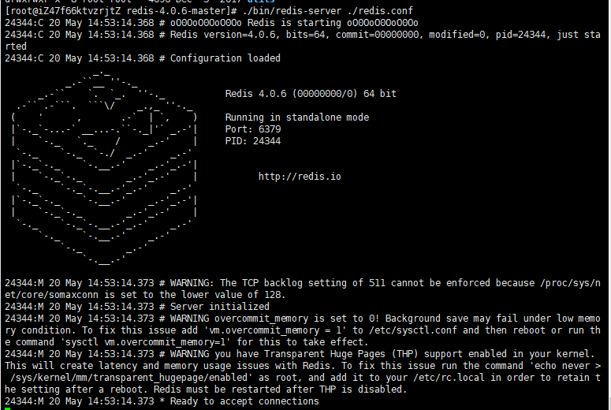
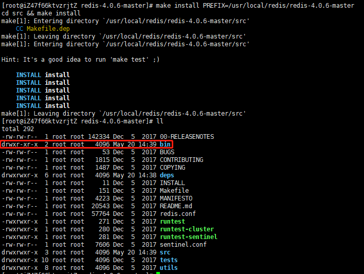
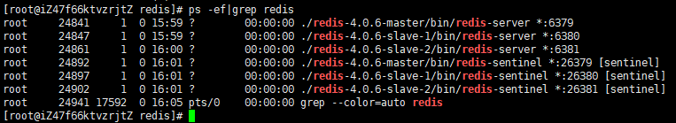

# linux 环境下

注：单机搭建redis主从及哨兵

## 一、单 redis 安装流程

>1. 下载安装包
>
>   wget http://download.redis.io/releases/redis-4.0.6.tar.gz
>
>2. 文件解压
>
>   tar -zxf redis-4.0.6.tar.gz
>
>3. 把redis-4.0.6文件移动至 /usr/local/redis 目录下，且重命名为 redis-4.0.6-master
>
>   mv redis-4.0.6 /usr/local/redis/redis-4.0.6-master
>
>4. 进入文件目录
>
>   cd /usr/local/redis/redis-4.0.6-master
>
>5. 编译文件
>
>   make
>
>6. 安装文件
>
>   make install PREFIX=/usr/local/redis/redis-4.0.6-master
>
>7. 启动测试，查看是否启动成功（通过 ctrl + c 退出）
>
>   ./bin/redis-server ./redis.conf
>
>   

注意：

1. PREFIX 后方为 redis 安装地址，安装成功后，安装目录下会出现 bin 文件目录

   

2. 如果在 第5步 编译失败，请执行如下指令，安装redis 环境支持

   ```shell
   yum install gcc-c++
   ```

## 二、主从 + 哨兵配置

### 1. 前置准备

>1. 进入文件目录
>
>   cd /usr/local/redis
>
>2. 从主服务器中，复制出两份从服务器
>
>   cp -r redis-4.0.6-master redis-4.0.6-slave-1
>
>   cp -r redis-4.0.6-master redis-4.0.6-slave-2
>
>3. 创建 redis 启动文件目录支持（一主、两从、三哨兵配置）
>
>   mkdir -p /usr/local/redis/data/6379/redisdb /usr/local/redis/data/6379/redislog
>
>   mkdir -p /usr/local/redis/data/6380/redisdb /usr/local/redis/data/6380/redislog
>
>   mkdir -p /usr/local/redis/data/6381/redisdb /usr/local/redis/data/6381/redislog
>
>   mkdir -p /usr/local/redis/data/26379/sentinel-work /usr/local/redis/data/26379/sentinellog
>
>   mkdir -p /usr/local/redis/data/26380/sentinel-work /usr/local/redis/data/26380/sentinellog
>
>   mkdir -p /usr/local/redis/data/26381/sentinel-work /usr/local/redis/data/26381/sentinellog

### 2. 主 redis 的配置及哨兵配置（端口6379）

**redis.conf**，**pidfile、logfile、dir 三个目录需要，须启动前提前创建！！！不然再启动日志redis.log 中会出现启动找不到配置目录失败。**

```
#后台启动
daemonize yes
pidfile "/usr/local/redis/data/6379/redis_6379.pid"  
# 绑定端口，port 6379 默认是6379 需要安全组开放端口
port 6379  
timeout 0  
tcp-keepalive 0  
loglevel notice  
# 指定启动日志路径
logfile "/usr/local/redis/data/6379/redislog/redis.log"  
databases 16  
save 900 1  
save 300 10  
save 60 10000  
stop-writes-on-bgsave-error yes  
rdbcompression yes  
rdbchecksum yes  
dbfilename "dump.rdb"  
# 指定数据存放路径
dir "/usr/local/redis/data/6379/redisdb" 
#如果做故障切换，不论主从节点都要填写密码且要保持一致  
masterauth "123456"
slave-serve-stale-data yes  
slave-read-only yes  
repl-disable-tcp-nodelay no  
slave-priority 98
#当前redis密码 
requirepass "123456" 
# 指定持久化方式
appendonly yes  
# appendfsync always  
appendfsync everysec  
# appendfsync no  
no-appendfsync-on-rewrite no  
auto-aof-rewrite-percentage 100  
auto-aof-rewrite-min-size 64mb  
lua-time-limit 5000  
slowlog-log-slower-than 10000  
slowlog-max-len 128  
notify-keyspace-events ""  
hash-max-ziplist-entries 512  
hash-max-ziplist-value 64  
list-max-ziplist-entries 512  
list-max-ziplist-value 64  
set-max-intset-entries 512  
zset-max-ziplist-entries 128  
zset-max-ziplist-value 64  
activerehashing yes  
client-output-buffer-limit normal 0 0 0  
client-output-buffer-limit slave 256mb 64mb 60  
client-output-buffer-limit pubsub 32mb 8mb 60  
hz 10  
aof-rewrite-incremental-fsync yes  
# Generated by CONFIG REWRITE  
```

**sentinel.conf**.

```
port 26379
#1表示在sentinel集群中只要有两个节点检测到redis主节点出故障就进行切换，单sentinel节点无效(自己测试发现的)
#如果3s内mymaster无响应，则认为mymaster宕机了
#如果10秒后,mysater仍没活过来，则启动failover
sentinel monitor mymaster 本机IP 6379 1
sentinel down-after-milliseconds mymaster 3000
sentinel failover-timeout mymaster 10000
daemonize yes
#指定工作目录
dir "/usr/local/redis/data/26379/sentinel-work"
protected-mode no
logfile "/usr/local/redis/data/26379/sentinellog/sentinel.log"
#redis主节点密码
sentinel auth-pass mymaster 123456
# Generated by CONFIG REWRITE
```

### 3. 从redis配置(端口6380)

```
daemonize yes  
pidfile "/usr/local/redis/data/6380/redis_6380.pid"  
port 6380  
timeout 0  
tcp-keepalive 0  
loglevel notice  
logfile "/usr/local/redis/data/6380/redislog/redis.log"  
databases 16  
save 900 1  
save 300 10  
save 60 10000  
stop-writes-on-bgsave-error yes  
rdbcompression yes  
rdbchecksum yes  
dbfilename "dump.rdb"  
dir "/usr/local/redis/data/6380/redisdb"  
#主节点密码  
masterauth "123456"
slave-serve-stale-data yes  
slave-read-only yes  
repl-disable-tcp-nodelay no  
slave-priority 98  
requirepass "123456"  
appendonly yes  
# appendfsync always  
appendfsync everysec  
# appendfsync no  
no-appendfsync-on-rewrite no  
auto-aof-rewrite-percentage 100  
auto-aof-rewrite-min-size 64mb  
lua-time-limit 5000  
slowlog-log-slower-than 10000  
slowlog-max-len 128  
notify-keyspace-events ""  
hash-max-ziplist-entries 512  
hash-max-ziplist-value 64  
list-max-ziplist-entries 512  
list-max-ziplist-value 64  
set-max-intset-entries 512  
zset-max-ziplist-entries 128  
zset-max-ziplist-value 64  
activerehashing yes  
client-output-buffer-limit normal 0 0 0  
client-output-buffer-limit slave 256mb 64mb 60  
client-output-buffer-limit pubsub 32mb 8mb 60  
hz 10  
aof-rewrite-incremental-fsync yes  
# Generated by CONFIG REWRITE  
#配置主节点信息  
slaveof 本机IP 6379 
```

**sentinel.conf**

```
port 26380
#1表示在sentinel集群中只要有两个节点检测到redis主节点出故障就进行切换，单sentinel节点无效(自己测试发现的)
#如果3s内mymaster无响应，则认为mymaster宕机了
#如果10秒后,mysater仍没活过来，则启动failover
sentinel monitor mymaster 本机IP 6380 1
sentinel down-after-milliseconds mymaster 3000
sentinel failover-timeout mymaster 10000
daemonize yes
#指定工作目录
dir "/usr/local/redis/data/26380/sentinel-work"
protected-mode no
logfile "/usr/local/redis/data/26380/sentinellog/sentinel.log"
#redis主节点密码
sentinel auth-pass mymaster 123456
# Generated by CONFIG REWRITE
```

### 4. 从redis配置(端口6381)

```
daemonize yes  
pidfile "/usr/local/redis/data/6381/redis_6381.pid"  
port 6381  
timeout 0  
tcp-keepalive 0  
loglevel notice  
logfile "/usr/local/redis/data/6381/redislog/redis.log"  
databases 16  
save 900 1  
save 300 10  
save 60 10000  
stop-writes-on-bgsave-error yes  
rdbcompression yes  
rdbchecksum yes  
dbfilename "dump.rdb"  
dir "/usr/local/redis/data/6381/redisdb"  
#主节点密码  
masterauth "123456"
slave-serve-stale-data yes  
slave-read-only yes  
repl-disable-tcp-nodelay no  
slave-priority 98  
requirepass "123456"  
appendonly yes  
# appendfsync always  
appendfsync everysec  
# appendfsync no  
no-appendfsync-on-rewrite no  
auto-aof-rewrite-percentage 100  
auto-aof-rewrite-min-size 64mb  
lua-time-limit 5000  
slowlog-log-slower-than 10000  
slowlog-max-len 128  
notify-keyspace-events ""  
hash-max-ziplist-entries 512  
hash-max-ziplist-value 64  
list-max-ziplist-entries 512  
list-max-ziplist-value 64  
set-max-intset-entries 512  
zset-max-ziplist-entries 128  
zset-max-ziplist-value 64  
activerehashing yes  
client-output-buffer-limit normal 0 0 0  
client-output-buffer-limit slave 256mb 64mb 60  
client-output-buffer-limit pubsub 32mb 8mb 60  
hz 10  
aof-rewrite-incremental-fsync yes  
# Generated by CONFIG REWRITE  
#配置主节点信息  
slaveof 本机IP 6379 
```

**sentinel.conf**

```
port 26381
#1表示在sentinel集群中只要有两个节点检测到redis主节点出故障就进行切换，单sentinel节点无效(自己测试发现的)
#如果3s内mymaster无响应，则认为mymaster宕机了
#如果10秒后,mysater仍没活过来，则启动failover
sentinel monitor mymaster 本机IP 6381 1
sentinel down-after-milliseconds mymaster 3000
sentinel failover-timeout mymaster 10000
daemonize yes
#指定工作目录
dir "/usr/local/redis/data/26381/sentinel-work"
protected-mode no
logfile "/usr/local/redis/data/26381/sentinellog/sentinel.log"
#redis主节点密码
sentinel auth-pass mymaster 123456
# Generated by CONFIG REWRITE
```

### 5. 注意

1. **pidfile、logfile、dir 三个目录需要，须启动前提前创建！！！**不然再启动日志redis.log 中会出现启动找不到配置目录失败。
2. 每一个配置对应的 **端口号、文件夹路径**，需要根据自己的配置对应上
3. 以上配置文件上**本机IP**，需要更换到本机实际IP

## 三、启动及测试

>1. 进入redis总目录
>
>   ​	cd /usr/local/redis/
>
>2. 依次启动主从redis服务
>
>   ./redis-4.0.6-master/bin/redis-server redis-4.0.6-master/redis.conf
>
>   ./redis-4.0.6-slave-1/bin/redis-server redis-4.0.6-slave-1/redis.conf
>
>   ./redis-4.0.6-slave-2/bin/redis-server redis-4.0.6-slave-2/redis.conf
>
>3. 依次启动哨兵服务
>
>   ./redis-4.0.6-master/bin/redis-sentinel redis-4.0.6-master/sentinel.conf 
>
>   ./redis-4.0.6-slave-1/bin/redis-sentinel redis-4.0.6-slave-1/sentinel.conf 
>
>   ./redis-4.0.6-slave-2/bin/redis-sentinel redis-4.0.6-slave-2/sentinel.conf 
>
>4. 查看连接情况（or 使用redis桌面连接工具尝试）
>
>   ps -ef|grep redis
>
>   

注：如启动过程中存在问题，根据配置启动项的日志，具体查看


## 参考链接

[1. Linux安装redis并搭建主从，哨兵](https://blog.csdn.net/ljy950914/article/details/105523652)

[2. linux安装redis+主从复制(包含哨兵)](https://zhuanlan.zhihu.com/p/89498490)