## 微信jsapi支付

### 1. 微信获取openid所需配置信息

1. 进入地址：[微信公众号平台](https://mp.weixin.qq.com/cgi-bin/home?t=home/index&token=1709035801&lang=zh_CN)

2. 进入**【开发】**—**【基本设置】**，配置 **开发者密码**、**服务器地址**、**令牌**、**消费加解密秘钥** 相关信息，开发者密码需要自己保存。

   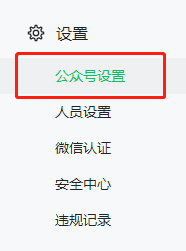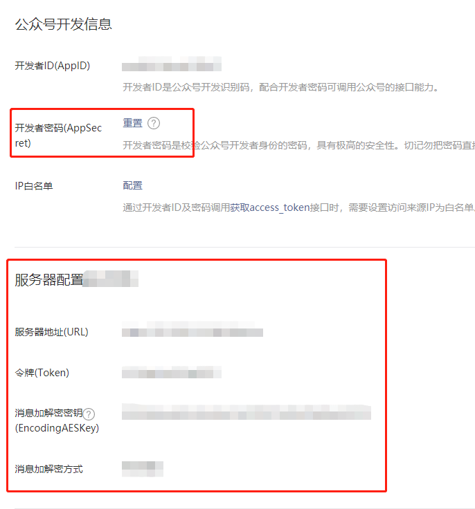

4. 进入 **【设置】**—**【公众号设置】**，点击**【功能设置】**，配置**网页授权域名**，用于获取**code**和**openid**选项

    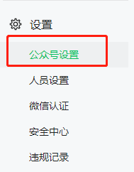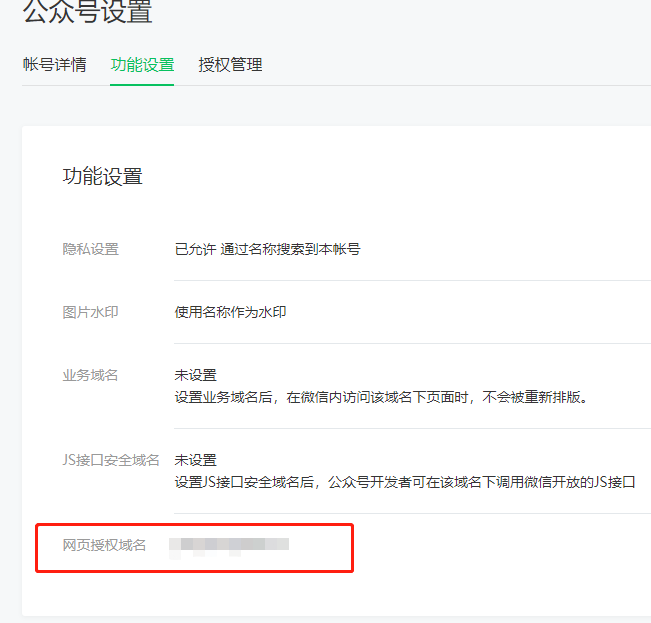

5. 参考代码如下

    ```java
    public static void main(String[] args) {
            
            //获取微信code
            String REDIRECT_URI="http://yangsongxiao.cn/Web/Web";
            String APPID="wxafb534aced348cf5";
            String SECRET="1c9d8089a89893fa077a597ef5d35055";
            String ACCESS_TOKEN_URL = "https://open.weixin.qq.com/connect/oauth2/authorize?appid=APPID&redirect_uri=REDIRECT_URI&response_type=code&scope=snsapi_base&state=STATE#wechat_redirect";
            String url = ACCESS_TOKEN_URL.replace("APPID", APPID).replace("STATE","1").replace("REDIRECT_URI", REDIRECT_URI );
            //微信访问这个页面  服务器可以获取到code 
            System.out.println(url);
            
            //获取openid
            String CODE="051pqs100IRy8L10XF300vWp1u1pqs1m";
            String url2 = "https://api.weixin.qq.com/sns/oauth2/access_token?appid=APPID&secret=SECRET&code=CODE&grant_type=authorization_code";
            String Get_Openid = url2.replace("APPID", APPID).replace("SECRET", SECRET).replace("CODE", CODE);
            System.out.println(Get_Openid);
            String resp = HttpUtil.doGetStr(Get_Openid);
            JSONObject re = JSONObject.parseObject(resp);
            String result = re.containsKey(InitConfig.OPEN_ID) ? re.getString(InitConfig.OPEN_ID) : InitConfig.ERR_START + re.getString(InitConfig.ERR_MSG);
            System.out.println(result);
    
        }
    ```

6. [微信获取openid方式参考链接](https://developers.weixin.qq.com/doc/offiaccount/OA_Web_Apps/Wechat_webpage_authorization.html)

7. [微信商户平台地址](https://pay.weixin.qq.com/index.php)


### 2. 前后端拉起

1. [JSAPI 调起支付参考链接](https://pay.weixin.qq.com/wiki/doc/apiv3/apis/chapter3_1_4.shtml)
2. [微信JSAPI开发指引](https://pay.weixin.qq.com/wiki/doc/apiv3/open/pay/chapter2_3.shtml)

### 3. 注意

​	**需要配置支付授权目录!!!  由于目前使用钱宝appid下单，所用授权目录地址为钱宝配置。**

## 微信小程序支付相关

> 目前仅知，需要钱宝下单的appid登录小程序开发工具，或者把我方小程序开发人员，拉入到下单appid的项目组中，借用其资质开发一个小程序可用。

### APP跳转小程序流程

1. 登录[微信开放平台](https://open.weixin.qq.com/)，并创建相关应用申请相关权限

   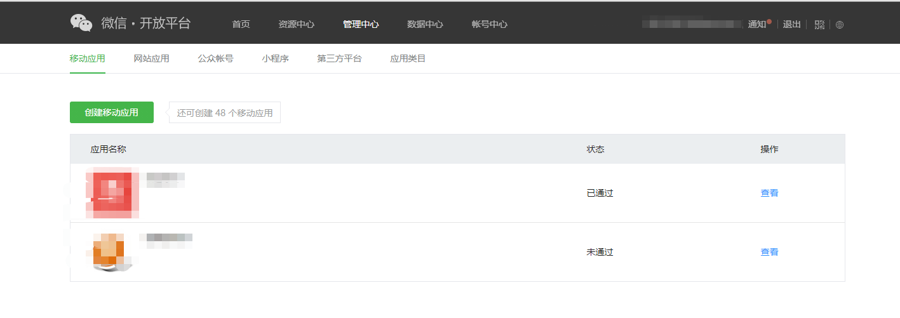

   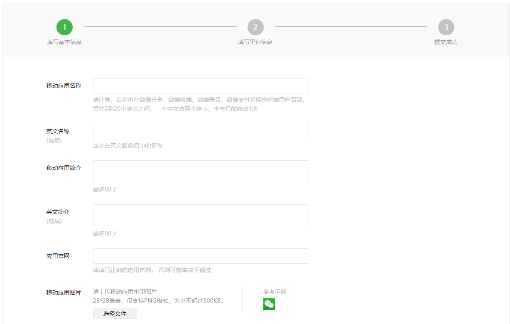

2. 获取相关开发信息，APP包名及签名对应上

   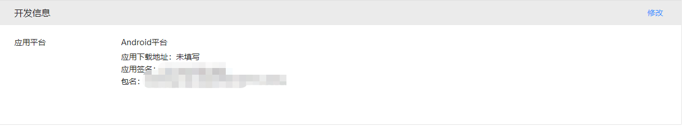

3. 根据微信官方开发文档，进行开发测试[APP 跳转小程序支付参考链接](https://developers.weixin.qq.com/doc/oplatform/Mobile_App/Launching_a_Mini_Program/Android_Development_example.html)

## 支付宝相关

### 1. 支付宝获取userid方法

1. 登录[支付宝开放平台](https://openhome.alipay.com/platform/home.htm)

   ```
   账号:  yhtdpay@163.com
   密码:  chen1992*+
   手机号绑定人：陈华材
   ```

2. 创建一个**【应用】**，进入**【应用】**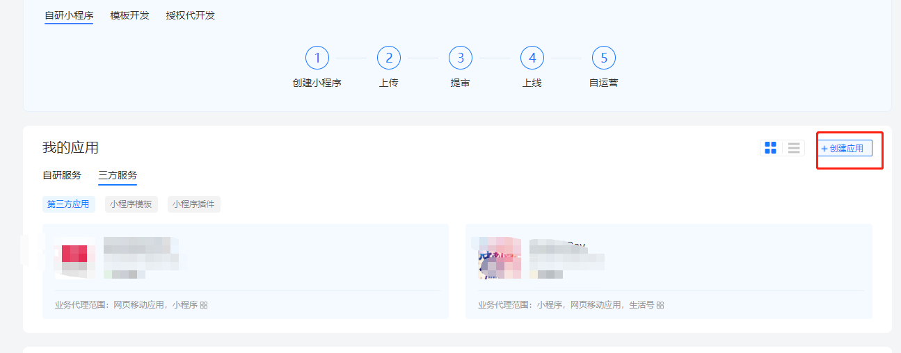

3.  点击**【设置】**按钮，配置**【接口加签方式】**（用于获取openid时加签验签操作）、**【授权回调地址】**（用来获取openid信息）

   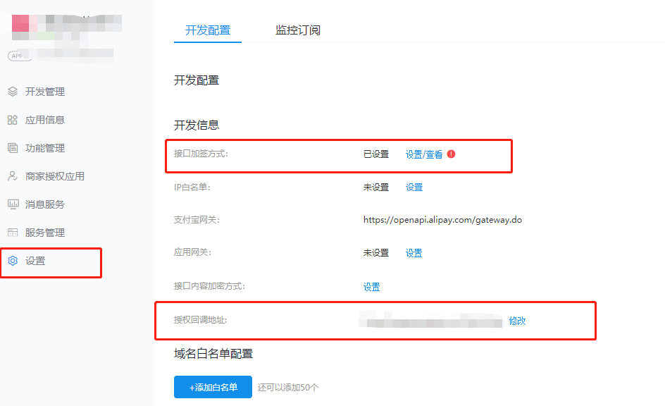

   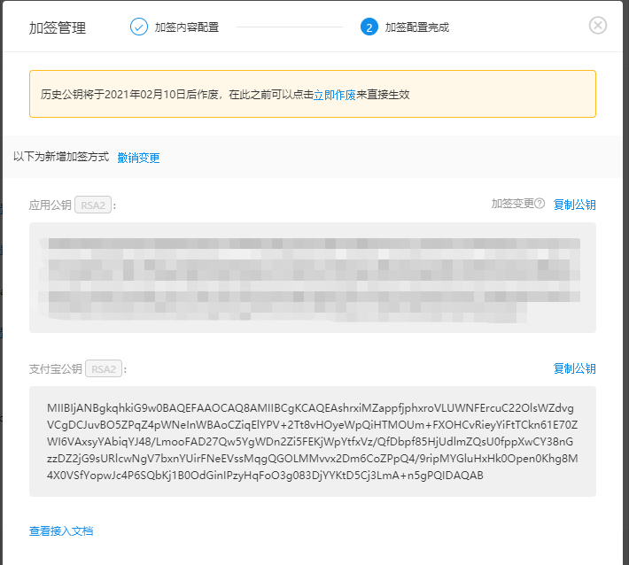

4. [获取userid参考链接](https://opendocs.alipay.com/isv/10467/xldcyq)

   [支付宝官方公私钥配置参考链接](https://opensupport.alipay.com/support/helpcenter/207/201602471154?ant_source=manual&recommend=ab2418594aa12994227b51f38a16d735)

5. 参考代码

   ```java
   		//获取zfb appid
           String appid="2021001156603164";
           //进行url转码
           String returnurl="http%3a%2f%2fyangsongxiao.cn%2fWeb%2fWeb";
           String url="https://openauth.alipay.com/oauth2/appToAppAuth.htm?app_id="+appid+"&redirect_uri="+returnurl;
           //支付宝访问这个地址，点击授权  服务器获取 app_id 和 app_auth_code
           System.out.println(url);
           String app_id="2021001156603164";
           String app_auth_code="06ff73b078c24a24bc720b038ec77B74";
   
           //支付宝公钥
           String alipay_public_key="MIIBIjANBgkqhkiG9w0BAQEFAAOCAQ8AMIIBCgKCAQEAshrxiMZappfjphxroVLUWNFErcuC22OlsWZdvgVCgDCJuvBO5ZPqZ4pWNeInWBAoCZiqElYPV+2Tt8vHOyeWpQiHTMOUm+FXOHCvRieyYiFtTCkn61E70ZWI6VAxsyYAbiqYJ48/LmooFAD27Qw5YgWDn2Zi5FEKjWpYtfxVz/QfDbpf85HjUdlmZQsU0fppXwCY38nGzzDZ2jG9sURlcwNgV7bxnYUirFNeEVssMqgQGOLMMvvx2Dm6CoZPpQ4/9ripMYGluHxHk0Open0Khg8M4X0VSfYopwJc4P6SQbKj1B0OdGinIPzyHqFoO3g083DjYYKtD5Cj3LmA+n5gPQIDAQAB";
   
           String app_private_key="";
   
           //获取AppAuthToken
           AlipayClient alipayClient= new DefaultAlipayClient( "https://openapi.alipay.com/gateway.do" ,  app_id , app_private_key , "json" ,  "GBK" ,  alipay_public_key , "RSA2" );
           AlipayOpenAuthTokenAppRequest request = new AlipayOpenAuthTokenAppRequest ();
           request.setBizContent (
                   "{"   + "\"grant_type\":\"authorization_code\","   +
                           "\"code\":\""+app_auth_code+"\"" +
                   "}"
           );
           AlipayOpenAuthTokenAppResponse response = alipayClient.execute ( request );
           System.out.println(response.getAppAuthToken());
   ```

### 2. 支付宝拉起支付

1. [支付宝老方式前端拉起支付链接](https://opendocs.alipay.com/open/common/105591)

   ```html
   <p id="result">result: </p>
   <script type="application/javascript">
       // 调试时可以通过在页面定义一个元素，打印信息，使用alert方法不够优雅
       function log(obj) {
           $("#result").append(obj).append(" ").append("<br />");
       }
   
       $(document).ready(function(){
           // 页面载入完成后即唤起收银台
           // 此处${tradeNO}为模板语言语法，实际调用样例类似为tradePpay("2016072621001004200000000752")
            tradePay("${tradeNO}"); 
   
            // 点击payButton按钮后唤起收银台
            $("#payButton").click(function() {
               tradePay("${tradeNO}");
            });
   
            // 通过jsapi关闭当前窗口，仅供参考，更多jsapi请访问
            // /aod/54/104510
            $("#closeButton").click(function() {
               AlipayJSBridge.call('closeWebview');
            });
        });
   
       // 由于js的载入是异步的，所以可以通过该方法，当AlipayJSBridgeReady事件发生后，再执行callback方法
        function ready(callback) {
            if (window.AlipayJSBridge) {
                callback && callback();
            } else {
                document.addEventListener('AlipayJSBridgeReady', callback, false);
            }
        }
   
        function tradePay(tradeNO) {
           ready(function(){
                // 通过传入交易号唤起快捷调用方式(注意tradeNO大小写严格)
                AlipayJSBridge.call("tradePay", {
   tradeNO: tradeNO
                }, function (data) {
                    log(JSON.stringify(data));
                    if ("9000" == data.resultCode) {
                        log("支付成功");
                    }
                });
           });
       }
   </script>
   ```

2. [支付宝新版拉起支付参考链接](https://myjsapi.alipay.com/alipayjsapi/util/pay/tradePay.html)

   ```js
   <script src="https://gw.alipayobjects.com/as/g/h5-lib/alipayjsapi/3.1.1/alipayjsapi.inc.min.js"></script>
   <script type="text/javascript">
       window.onload = function () {
       /* 支付宝 */
       var btn = document.querySelector('#J_btn');
       btn.addEventListener('click', function(){
           alert("支付")
           ap.tradePay({
               tradeNO: '2021020322001430791435578886',
           }, function(res){
               ap.alert(res.resultCode);
           });
       });
   </script>
   ```

### 3. 支付宝秘钥相关

1. 支付宝平台公钥

```java
MIIBIjANBgkqhkiG9w0BAQEFAAOCAQ8AMIIBCgKCAQEAshrxiMZappfjphxroVLUWNFErcuC22OlsWZdvgVCgDCJuvBO5ZPqZ4pWNeInWBAoCZiqElYPV+2Tt8vHOyeWpQiHTMOUm+FXOHCvRieyYiFtTCkn61E70ZWI6VAxsyYAbiqYJ48/LmooFAD27Qw5YgWDn2Zi5FEKjWpYtfxVz/QfDbpf85HjUdlmZQsU0fppXwCY38nGzzDZ2jG9sURlcwNgV7bxnYUirFNeEVssMqgQGOLMMvvx2Dm6CoZPpQ4/9ripMYGluHxHk0Open0Khg8M4X0VSfYopwJc4P6SQbKj1B0OdGinIPzyHqFoO3g083DjYYKtD5Cj3LmA+n5gPQIDAQAB
```

2. 商户自己公私钥

   2.1 公钥

   ```java
   MIIBIjANBgkqhkiG9w0BAQEFAAOCAQ8AMIIBCgKCAQEAstPGBWAJfHmu3WXWnX2TRM8doL1oDmgmIc0mVLvJyjI937KpCXpE8STz5dWgIGnzuuvhx7iWWbRA33ItzwQD61aatGjWlUA9afyU6mqkWk8X2HogbfnLTo+X7DKVLk+v7fLXxc7PKP3albF9rNs3qdNbwe+6WoOLv6JXgBXgWxGeGNNWIMyI34+f1bnPhw5dhFKkVMBsVTmbI8CFlhUaBy1oW+lF2bviDPn4OPfuhizPg2DKaRKPv8ucnBWrYnSN2jQZWoK72lf8qxl8Musi4sOMzhXWN0mVA0DAr4v9MQccbsmjjm6agyHeYmC+dmP7C9dwjxwvQKfhSNNdAnWpTQIDAQAB
   ```

   2.2 私钥

   ```java
   MIIEvQIBADANBgkqhkiG9w0BAQEFAASCBKcwggSjAgEAAoIBAQCy08YFYAl8ea7dZdadfZNEzx2gvWgOaCYhzSZUu8nKMj3fsqkJekTxJPPl1aAgafO66+HHuJZZtEDfci3PBAPrVpq0aNaVQD1p/JTqaqRaTxfYeiBt+ctOj5fsMpUuT6/t8tfFzs8o/dqVsX2s2zep01vB77pag4u/oleAFeBbEZ4Y01YgzIjfj5/Vuc+HDl2EUqRUwGxVOZsjwIWWFRoHLWhb6UXZu+IM+fg49+6GLM+DYMppEo+/y5ycFatidI3aNBlagrvaV/yrGXwy6yLiw4zOFdY3SZUDQMCvi/0xBxxuyaOObpqDId5iYL52Y/sL13CPHC9Ap+FI010CdalNAgMBAAECggEAP+emEC2ttinV75CBDW7evew17kdBdESLu/CQDh+9kOA7dEFoXtau5G4MKsoYmvzB+L5qxPCV6iCcPj2TWTNaIzOjvWzpohR+3e1BWjQZ35v8LYQXKrXljYGLDQFWhmI7wJDTwwCQz1lIT85J1wfP8IRzee6tbcMsoaLmGgO3VVNwp9kkbwODG/d48P33joQ8MT0JUjZUDGQGaRhVLh1GOfJny9rT2CmNIrzNriovwb4Gz4+UFLGNhbPOHZPBS62mnEzm/0Yjhj4V9y9qxt6IygwAs08rjRRY1bwQf1WoHp3bT2k5ueB2QF9b2MXljzC3yloufGkzD/vASp+T6xK4AQKBgQDtZxxLZPzS5YDN18CX1efqkMZGS+ov4y+aXM6W34eRIYeN5PUIkCoRER+G6B47y0b498JYMqgSkDEzy+PfYTIE0evMSnbYpU62chqRQ0k5dOWTScJyuEDdPyQpRv4ECSEyVuV48i1AWTH8AH+PLFj5A55j05rsGNk+OR9PXCt9zQKBgQDA1fxXHdbyGh9hqWyvUE4p9gbwhA2Qq6pkrDM68JcxokNpw9WuGsU4hHeqx4+FvVOqPH9RrfAKHUTB6ADWz47Z5i7+LxPbue///TX81m76V/8soxCMVME1lDmOO6vBOxIvYYP2dVFPT7JGmECbcuY/bghrlWzknN4RewB0MgtZgQKBgFh6SlBLFfLfuA5/b3bnMOT6CftfBavNRwuHtTMDofnT/jpC75O+bv8nW5Gi5smwLAZUCGloj71DYiMExSuWhNbJCdF8myiJC3nxsrca1aqFR56KKd8pjnsmsip0G+2THX0uZ52Y3IaT944M/X11sL81uw1HawC9DhIjpeik2EytAoGAJ/Ir+7/qruxKY+i84vQ3vOmCNoCkbrug6Injcuoz58w9OsOemBpjkHmgcHg2evXlRvaRSVJGz1GQ1LpCsjz80pakVXNbIcE6vkSt0lp5UtK3wX9mBivoejjiU1x5D+Y0tiv1MjDLTyqrO4R+nbUHjUw14lNp41G7jtN0HJ3hTAECgYEAkgtwQMEydeqaJ5VV74B3xeQwa5jLUuoosbRg8qSD8UGHl1+i7k2ttumtv0t4NpMpVjmO/n9WOld3BAvrN3IuO1FVmc9JuNBP9s+vQxeD9wvx0XcB4RKlY7mNAi/J3WQkBJfj1q0hTGtB9ZxWLfqLIv9yDxYPkWoPyJwWxA0ohBA=
   ```

## QQ 

### 1. 获取sid流程

### 2. 前端代码

```js
<script type="application/javascript" src="https://open.mobile.qq.com/sdk/qqapi.js?_bid=152"></script>
<script type="text/javascript">
	function pay(){
            //验证是否是QQ
            mqq.device.isMobileQQ(function(result){
                if(result) {
                    var isIos = mqq.iOS;
                    //alert("是否是IOS:" + isIos);
                    var isAndroid = mqq.android;
                    //alert("是否是Android:" + isAndroid);
                    var qqVersion = mqq.QQVersion;
                    //alert("QQVersion:" + qqVersion);
                    //唤起QQ钱包
                    this.callPay()
                } else {
                    alert("请在手机QQ中打开此页面");
                    return false;
                }
            });
        }

        function callPay(){
            mqq.tenpay.pay({
                tokenId: "5Mfd2ffe642c61f498b8c03a4638a04e",
            }, function(result, resultCode){
                if(result == "Permission denied") {
                    alert("无权限 ");
                } else {
                    alert(result.resultCode);
                    document.location.href = "${redirectUrl}";
                }
            });
        }
</script>
```

## 具体实现相关

### 第一种方法（动态码）：

>微信、支付宝 外包聚合支付页面，本质均使用 动态码下单 在浏览器中打开操作

### 第二种方法（jsapi）：

>微信支付宝使用先授权，外包聚合支付页面，再通过jsapi支付接口下单拉起支付。

注：云闪付相关实现方式存疑。

## 钱宝相关

```
测试商户号：848290972306000  
测试终端号：29002210
目前配置支付授权目录：http://yangsongxiao.cn/ysf/
```

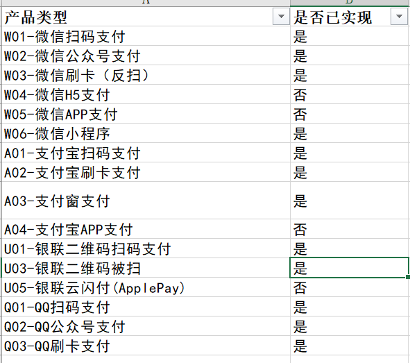

## 参考链接

[jsapi 的微信githup](https://github.com/monk6658/unionpay-solidcode)