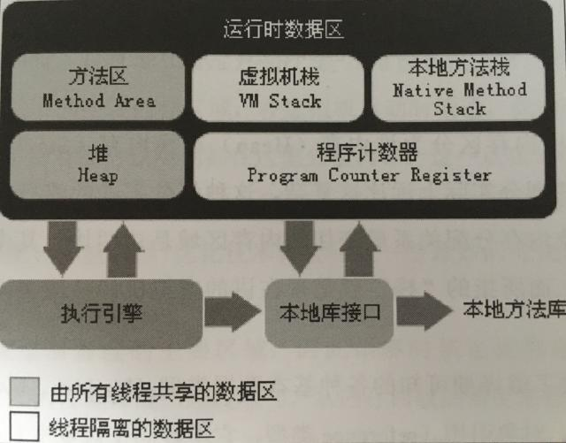
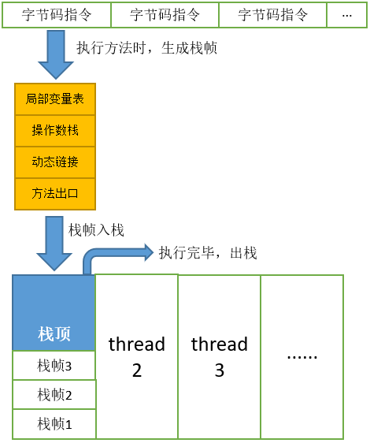
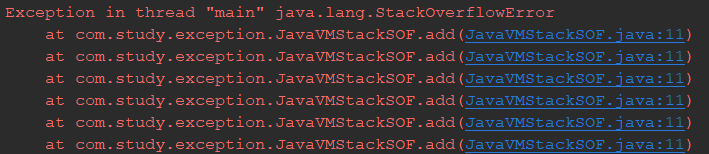

# 并发基础

[TOC]

## 1. 什么是线程和进程？

### 1.1 进程

&emsp;进程是程序的一次执行过程，**是操作系统分配资源的最小单位**，因此进程是动态的。


### 1.2 线程

&emsp;线程是程序执行的最小单位，一个进程在其执行的过程中可以产生多个线程。每个线程有自己的<span style="font-size:20px;color:red;weight:bold;">**程序计数器、虚拟机栈、本地方法栈**</span>，多个线程共享进程的<span style="font-size:20px;color:red;weight:bold;">**堆**、**方法区资源**</span>。


### 1.3 区别

|            | 进程                         | 线程                                                         |
| ---------- | ---------------------------- | :----------------------------------------------------------- |
| 概念       | 是操作系统分配资源的最小单位 | 线程是程序执行的最小单位                                     |
| 组成       | 由一个或多个线程组成         | 仅是线程下的一条执行线路                                     |
| 资源       | 进程之间相互独立             | 同一进程下，各个线程之前共享程序的内存空间（代码段、数据集、堆等）及一些进程级的资源。执行开销小，不利于资源管理及保护 |
| 调度与切换 | 慢                           | 线程上下文切换快                                             |

## 2. 线程详解

### 2.1 程序计数器为什么是私有的

&emsp;程序计数器作用：

1. 字节码解释器通过改变程序计数器来依次读取指令，从而实现代码的流程控制，如：顺序执行、选择、异常处理
2. 在多线程的情况下，程序计数器用于记录当前线程执行的位置，从而当线程被切换回来的时候能够知道该线程上次运行到哪了

&emsp;所以，程序计数器私有主要是为了**线程切换后能恢复到正确的执行位置**。

### 2.2 虚拟机栈和本地方法栈



#### 2.2.1 虚拟机栈

##### 2.2.1.1 虚拟机栈讲解

　**虚拟机栈是用于描述java方法执行的内存模型。**

&emsp;每个java方法在执行时，会创建一个“栈帧（stack frame）”，栈帧的结构分为“局部变量表、操作数栈、动态链接、方法出口”几个部分。我们常说的“堆内存、栈内存”中的**“栈内存”指的便是虚拟机栈**，确切地说，指的是虚拟机栈的栈帧中的局部变量表，因为这里存放了一个方法的所有局部变量。

&emsp;方法调用时，创建栈帧，并压入虚拟机栈；方法执行完毕，栈帧出栈并被销毁，如下图所示：



##### 2.2.1.2 虚拟机栈特点

&emsp;虚拟机栈是线程隔离的，即每个线程都有自己独立的虚拟机栈。

##### 2.2.1.3 虚拟机栈的StackOverflowError

&emsp;**单个线程请求的栈深度大于虚拟机允许的深度，则会抛出StackOverflowError（栈溢出错误）。**

&emsp;JVM会为每个线程的虚拟机栈分配一定的内存大小（-Xss参数），因此虚拟机栈能够容纳的栈帧数量是有限的，若栈帧不断进栈而不出栈，最终会导致当前线程虚拟机栈的内存空间耗尽，典型如一个无结束条件的递归函数调用，代码见下：

```
public class JavaVMStackSOF {

    private void add(int c){
        add(c++);
    }

    public static void main(String[] args) {
        try {
            new JavaVMStackSOF().add(0);
        }catch (Exception e){
            e.printStackTrace();
        }
    }

}
```

&emsp;在不断的循环调用，最终超出虚拟机允许的深度，抛出栈溢出错误。



##### 2.2.1.4 虚拟机栈的OutOfMemoryError

&emsp;**OutOfMemoryError指的是当整个虚拟机栈内存耗尽，并且无法再申请到新的内存时抛出的异常。**

&emsp;JVM未提供设置整个虚拟机栈占用内存的配置参数。虚拟机栈的最大内存大致上等于“JVM进程能占用的最大内存（依赖于具体操作系统） - 最大堆内存 - 最大方法区内存 - 程序计数器内存（可以忽略不计） - JVM进程本身消耗内存”。当虚拟机栈能够使用的最大内存被耗尽后，便会抛出OutOfMemoryError，可以通过不断开启新的线程来模拟这种异常（建议不要尝试，容易把电脑跑蹦）

```
public class JavaVMStackOOM {

    public static void main(String[] args) {
        while(true){
            new Thread(() -> {
                while (true){

                }
            }).start();
        }
    }
}
```

#### 2.2.2 本地方法栈

&emsp;和虚拟机栈所发挥的作用非常相似，区别是： **虚拟机栈为虚拟机执行 Java 方法 （也就是字节码）服务，而本地方法栈则为虚拟机使用到的 Native 方法服务（例如Thread.start0()）。** 在 HotSpot 虚拟机中和 Java 虚拟机栈合二为一。由于native方法不是用Java实现的，而是由C语言实现的，本地方法栈也会抛出StackOverflowError和OutOfMemoryError异常。

<p style="color:red">&emsp;为了保证线程中的局部变量不被别的线程访问到，虚拟机栈和本地方法栈是线程私有的。</p>

### 2.3 堆

#### 2.3.1 什么是堆

&emsp;堆是用于存放对象的内存区域。因此，他是垃圾收集器（GC）管理的主要目标。

#### 2.3.2 特点

1. 堆在逻辑上划分为**新生代**和**老年代**。由于JAVA中的对象大部分是朝生夕灭，还有一小部分能够长期的驻留在内存中，为了对这两种对象进行最有效的回收，将堆划分为新生代和老年代，并且执行不同的回收策略。不同的垃圾收集器对这2个逻辑区域的回收机制不尽相同，
2. 堆占用的内存并不要求物理连续，只需要逻辑连续即可。
3. 堆一般实现成可扩展内存大小，使用“-Xms”与“-Xmx”控制堆的最小与最大内存，扩展动作交由虚拟机执行。但由于该行为比较消耗性能，因此一般将堆的最大最小内存设为相等。
4. 堆是所有线程共享的内存区域，因此每个线程都可以拿到堆上的同一个对象。
5. 堆的生命周期是随着虚拟机的启动而创建。

#### 2.3.3 堆异常

&emsp;当堆无法分配对象内存且无法再扩展时，会抛出OutOfMemoryError异常。

```
public class HeapOOM {

    static class OOMObject {
    }

    public static void main(String[] args) {
        List<OOMObject> list = new ArrayList<>();
        //不断创建新对象，使得Heap溢出
        while (true) {
            list.add(new OOMObject());
        }
    }

}
```

&emsp;述代码中对象不断的被创建而不进行引用释放，导致GC无法回收堆内存，最终OutOfMemoryError，错误信息：

```
java.lang.OutOfMemoryError: Java heap space
```

### 2.4 方法区

#### 2.4.1 方法区定义

&emsp;方法区，也称非堆（Non-Heap），是一个被线程共享的内存区域。其中主要存储加载的类字节码、class/method/field等元数据对象、static-final常量、static变量、jit编译器编译后的代码等数据。

&emsp;如果系统定义太多的类，导致方法区溢出。虚拟机同样会抛出内存溢出的错误。方法区可以理解为永久区。

### 2.5 上下文切换

> 当前任务在执行完 CPU 时间片切换到另一个任务之前会先保存自己的状态，以便下次再切换回这个任务时，可以再加载这个任务的状态。**任务从保存到再加载的过程就是一次上下文切换**。

&emsp;多线程编程中一般线程的个数都大于 CPU 核心的个数，而一个 CPU 核心在任意时刻只能被一个线程使用，为了让这些线程都能得到有效执行，CPU 采取的策略是为每个线程分配时间片并轮转的形式。当一个线程的时间片用完的时候就会重新处于就绪状态让给其他线程使用，这个过程就属于一次上下文切换。

&emsp;上下文切换通常是计算密集型的。也就是说，它需要相当可观的处理器时间，在每秒几十上百次的切换中，每次切换都需要纳秒量级的时间。所以，上下文切换对系统来说意味着消耗大量的 CPU 时间，事实上，可能是操作系统中时间消耗最大的操作。

&emsp;Linux 相比与其他操作系统（包括其他类 Unix 系统）有很多的优点，其中有一项就是，其上下文切换和模式切换的时间消耗非常少。

### 2.6 死锁

#### 2.6.1 死锁的定义

&emsp;多个线程同时被阻塞，它们中的一个或者全部都在等待某个资源被释放。


#### 2.6.2 死锁的条件

1. 互斥条件：该资源任意一个时刻只由一个线程占用。
2. 请求与保持条件：一个进程因请求资源而阻塞时，对已获得的资源保持不放。
3. 不剥夺条件:线程已获得的资源在末使用完之前不能被其他线程强行剥夺，只有自己使用完毕后才释放资源。
4. 循环等待条件:若干进程之间形成一种头尾相接的循环等待资源关系。

#### 2.6.3 如何避免死锁

&emsp;为了避免死锁，我们只要破坏产生死锁的四个条件中的其中一个就可以了。

1. **破坏互斥条件** ：这个条件我们没有办法破坏，因为我们用锁本来就是想让他们互斥的（临界资源需要互斥访问）。
2. **破坏请求与保持条件** ：一次性申请所有的资源。
3. **破坏不剥夺条件** ：占用部分资源的线程进一步申请其他资源时，如果申请不到，可以主动释放它占有的资源。
4. **破坏循环等待条件** ：靠按序申请资源来预防。按某一顺序申请资源，释放资源则反序释放。破坏循环等待条件。

## 3 角料

### 3.1  start() 和run() 方法

&emsp;**调用 start 方法方可启动线程并使线程进入就绪状态，而 run 方法只是 thread 的一个普通方法调用，还是在主线程里执行。**

### 3.2 wait()方法和sleep()方法

|      | **sleep 方法**                                               | **wait 方法**                            |
| ---- | ------------------------------------------------------------ | ---------------------------------------- |
| 1    | **没有释放锁**                                               | **释放了锁**                             |
| 2    | 用于暂停执行                                                 | 用于线程间交互/通信                      |
| 3    | 被调用后，线程不会自动苏醒，需要别的线程调用同一个对象上的 notify() 或者 notifyAll() 方法 | sleep() 方法执行完成后，线程会自动苏醒。 |
| 4    | 两者都可以暂停线程的执行。                                   |                                          |


## 参考链接

\- [Java 并发基础常见面试题总结](https://snailclimb.gitee.io/javaguide/#/docs/java/multi-thread/2020%E6%9C%80%E6%96%B0Java%E5%B9%B6%E5%8F%91%E5%9F%BA%E7%A1%80%E5%B8%B8%E8%A7%81%E9%9D%A2%E8%AF%95%E9%A2%98%E6%80%BB%E7%BB%93?id=java-%e5%b9%b6%e5%8f%91%e5%9f%ba%e7%a1%80%e5%b8%b8%e8%a7%81%e9%9d%a2%e8%af%95%e9%a2%98%e6%80%bb%e7%bb%93)

\- [02-JVM内存模型：虚拟机栈与本地方法栈](https://www.cnblogs.com/manayi/p/9293302.html)

\- [03-JVM内存模型：堆与方法区](https://www.cnblogs.com/manayi/p/9651500.html)

