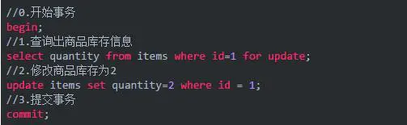
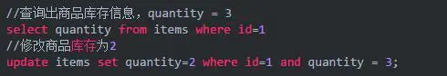
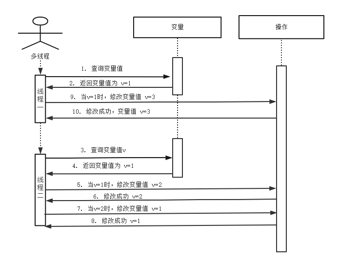

## 悲观锁

[TOC]

### 1. 悲观锁定义

在修改数据之前先锁定，再修改的方式被称之为悲观并发控制【Pessimistic Concurrency Control，缩写“PCC”，又名“悲观锁”】。

**共享资源每次只给一个线程使用，其它线程阻塞，用完后再把资源转让给其它线程。**

悲观锁，具有强烈的独占和排他特性。传统的关系型数据库里边就用到了很多这种锁机制，比如行锁，表锁等，读锁，写锁等，都是在做操作之前先上锁。Java中`synchronized`和`ReentrantLock`等独占锁就是悲观锁思想的实现。

### 2. 种类

1.  共享锁【shared locks】又称为读锁，简称S锁。多个事务对于同一数据可以共享一把锁，都能访问到数据，但是只能读不能修改。
2.  排他锁【exclusive locks】又称为写锁，简称X锁。排他锁就是不能与其他锁（共享锁、排他锁）并存，获取排他锁的事务是可以对数据行读取和修改。

### 3. 说明

悲观并发控制实际上是“先取锁再访问”的保守策略。

- **处理加锁的机制会让数据库产生额外的开销，增加产生死锁的机会**
- ***降低并行性***（一个事务如果锁定了某行数据，其他事务就必须等待该事务处理完才可以处理那行数据。）

### 4. 实现方式

1. 修改之前，先加上排它锁(exclusive locks)

2. 加锁失败，说明该记录正在修改，线程陷入等待或者抛出异常

3. 加锁成功，修改，事务结束之后解锁

   

[^ ]:注：mysql设置非立马提交（set autocommit=0）MySQL InnoDB 默认行级锁。行级锁都是基于索引的，如果一条 SQL 语句用不到索引是不会使用行级锁的，会使用表级锁把整张表锁住。

## 乐观锁

### 1. 乐观锁定义

**乐观锁一般会使用版本号机制或CAS算法实现。**乐观锁适用于多读的应用类型，这样可以提高吞吐量**，像数据库提供的类似于write_condition机制**，其实都是提供的乐观锁。在Java中`java.util.concurrent.atomic`包下面的原子变量类就是使用了乐观锁的一种实现方式**CAS**实现的。

### 2. 两种实现方式

#### 2.1 **CAS 实现**(compare and swap[比较与交换])

Java 中java.util.concurrent.atomic包下面的原子变量使用了乐观锁的一种 CAS 实现方式。多个线程尝试使用 CAS 同时更新同一个变量时，只有其中一个线程能更新变量的值，而其它线程都失败，失败的线程并不会被挂起，而是被告知这次竞争中失败，并可以再次尝试。

#### 2.2 版本号机制

##### 2.2.1 ABA 问题

如图流程可以看出，当线程一读取变量v=1，这时线程二读取的变量v=1，并且线程二对变量v=1 进行了修改操作。使v=2，之后又使v=1。这时，线程一进行了CAS操作，发现变量v=1,这时线程一也成功了，但是过程是存在ABA问题的。

##### 2.2.2 版本号

乐观锁每次操作时都带上一个版本号，一旦版本号和数据的版本号一致就可以执行修改操作并对版本号执行+1操作，否则就执行失败。因为每次操作的版本号都会随之增加，所以不会出现 ABA 问题，因为版本号只会增加不会减少。除了 version 以外，还可以使用时间戳，因为时间戳天然具有顺序递增性。

### 3. **CAS与synchronized的使用情景**

> **简单的来说CAS适用于写比较少的情况下（多读场景，冲突一般较少），synchronized适用于写比较多的情况下（多写场景，冲突一般较多）**

1. 对于资源竞争较少（线程冲突较轻）的情况，使用`synchronized`同步锁进行线程阻塞和唤醒切换以及用户态内核态间的切换操作额外浪费消耗cpu资源；而CAS基于硬件实现，不需要进入内核，不需要切换线程，操作自旋几率较少，因此可以获得更高的性能。
2. 对于资源竞争严重（线程冲突严重）的情况，CAS自旋的概率会比较大，从而浪费更多的CPU资源，效率低于synchronized。

补充： Java并发编程这个领域中`synchronized`关键字一直都是元老级的角色，很久之前很多人都会称它为 **“重量级锁”** 。但是，在JavaSE 1.6之后进行了主要包括为了减少获得锁和释放锁带来的性能消耗而引入的 **偏向锁** 和 **轻量级锁** 以及其它**各种优化**之后变得在某些情况下并不是那么重了。`synchronized`的底层实现主要依靠 **Lock-Free** 的队列，基本思路是 **自旋后阻塞**，**竞争切换后继续竞争锁**，**稍微牺牲了公平性，但获得了高吞吐量**。在线程冲突较少的情况下，可以获得和CAS类似的性能；而线程冲突严重的情况下，性能远高于CAS。

### 4. 两者比较

|          | 乐观锁                                                       | 悲观锁                                                       |
| -------- | ------------------------------------------------------------ | ------------------------------------------------------------ |
| 适用场景 | **适用于写比较少的情况下（多读场景）**                       | **多写的场景下用悲观锁就比较合适**                           |
| 实现     | 1. CAS  2. 版本号机制                                   | 1. 传统的关系型数据库的行锁，表锁等，读锁，写锁等 2. [synchronized](https://www.jianshu.com/p/c8f997e7f75c) 关键字 |
| 缺点     | 1. ABA问题 2. 循环时间长开销大（自旋CAS（也就是不成功就一直循环执行直到成功）） 3. 只能保证一个共享变量的原子操作 | 1.效率低 2.容易产生死锁                                 |

\- [什么是乐观锁，什么是悲观锁](https://www.jianshu.com/p/d2ac26ca6525)

\- [何谓悲观锁与乐观锁](https://snailclimb.gitee.io/javaguide/#/docs/essential-content-for-interview/%E9%9D%A2%E8%AF%95%E5%BF%85%E5%A4%87%E4%B9%8B%E4%B9%90%E8%A7%82%E9%94%81%E4%B8%8E%E6%82%B2%E8%A7%82%E9%94%81?id=_1-%e7%89%88%e6%9c%ac%e5%8f%b7%e6%9c%ba%e5%88%b6)